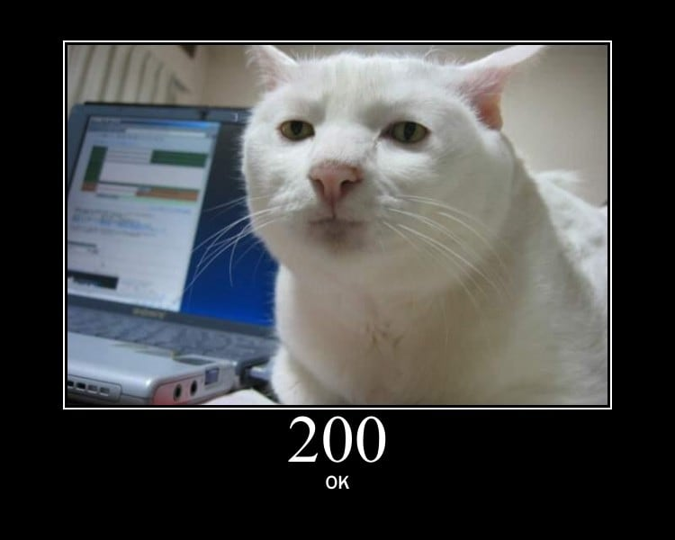

# jokeeeeee

A tiny joke npm package for demos. When npm runs its `postinstall` lifecycle, it prints a joke and opens the bundled copy of the original cat image in a local page that scales it up to fit the browser window. The image is included in the package, so displaying it works offline. Fullscreen browser mode remains controlled by the person using the computer.



## Install from the archive

Create a portable archive in this folder:

```powershell
npm pack
```

Copy the resulting `jokeeeeee-1.0.0.tgz` to the other PC, then run:

```powershell
npm install "C:\path\to\jokeeeeee-1.0.0.tgz"
```

For example, when the archive is in the current directory: `npm install .\jokeeeeee-1.0.0.tgz`.

This package is not published to npm, so `npm install jokeeeeee` by itself will not resolve. The browser-opening step may do nothing in a headless environment. The package does not download or execute remote code, does not read user files, and does not send data anywhere.
